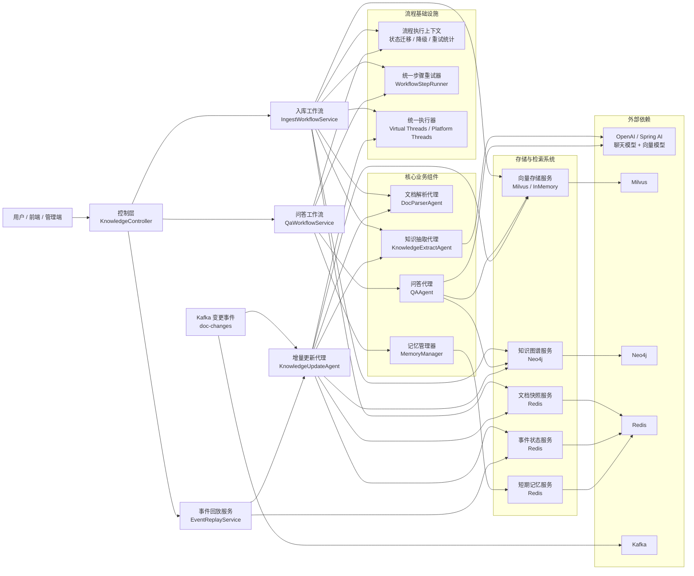
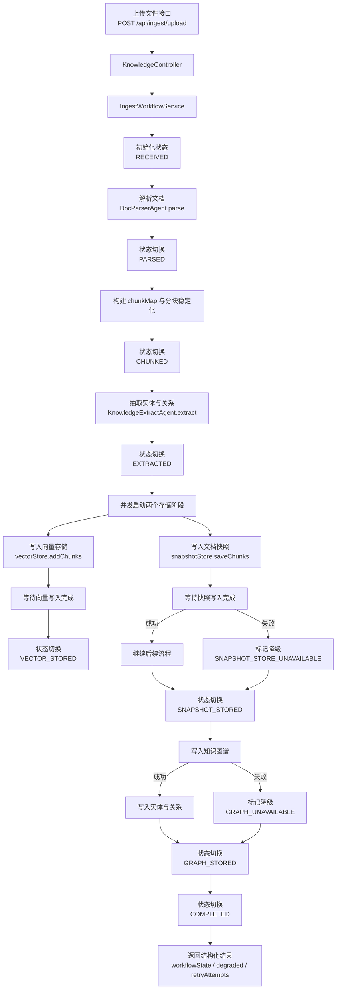
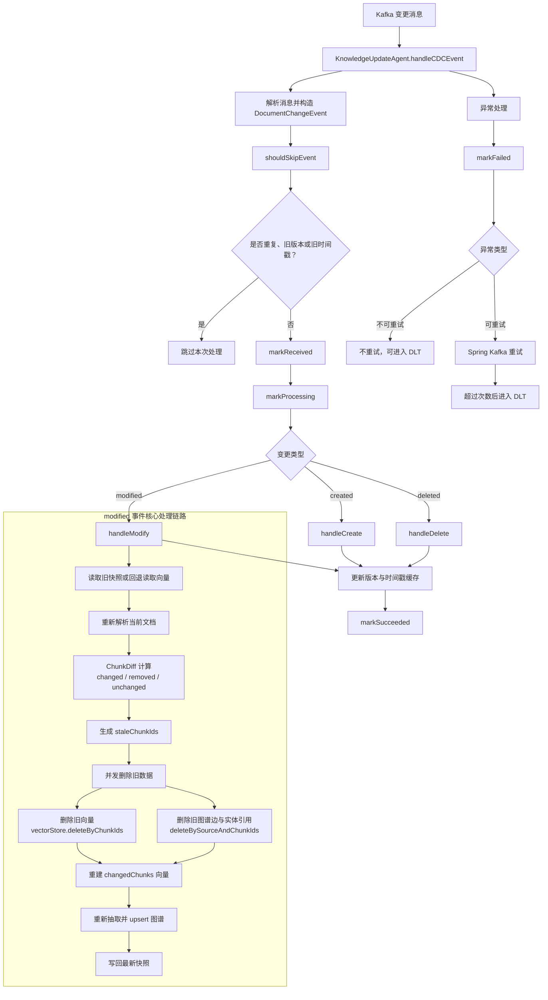
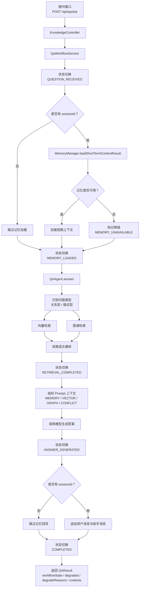
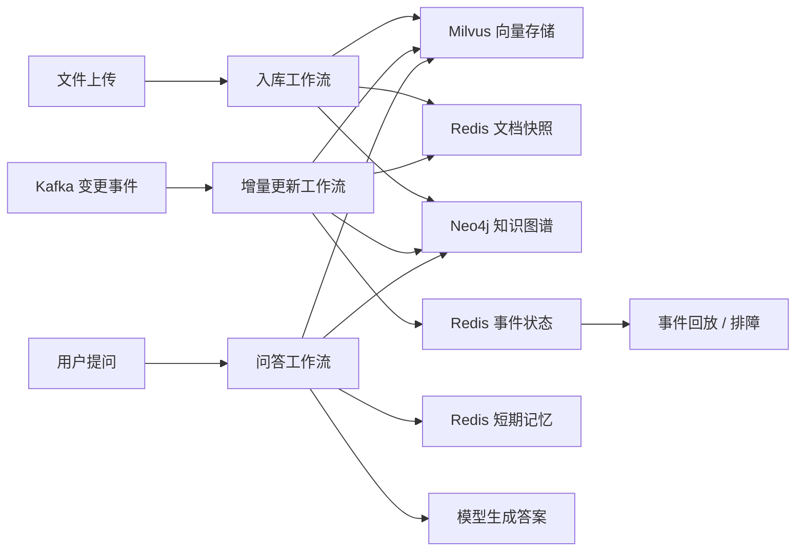

# 项目架构图与运行流程图（中文标签版）

这份文档是中文标签版的架构与流程图，适合直接导出为 `SVG`、`PNG`，用于答辩、PPT 或文档展示。

## 1. 系统架构图

```mermaid
flowchart LR
    用户["用户 / 前端 / 管理端"] --> 控制层["控制层<br/>KnowledgeController"]
    CDC["Kafka 变更事件<br/>doc-changes"] --> 更新代理["增量更新代理<br/>KnowledgeUpdateAgent"]

    控制层 --> 入库流程["入库工作流<br/>IngestWorkflowService"]
    控制层 --> 问答流程["问答工作流<br/>QaWorkflowService"]
    控制层 --> 回放服务["事件回放服务<br/>EventReplayService"]

    subgraph 流程基础设施["流程基础设施"]
        上下文["流程执行上下文<br/>状态迁移 / 降级 / 重试统计"]
        重试器["统一步骤重试器<br/>WorkflowStepRunner"]
        执行器["统一执行器<br/>Virtual Threads / Platform Threads"]
    end

    入库流程 --> 上下文
    入库流程 --> 重试器
    入库流程 --> 执行器

    问答流程 --> 上下文
    问答流程 --> 重试器

    更新代理 --> 执行器

    subgraph 核心组件["核心业务组件"]
        解析代理["文档解析代理<br/>DocParserAgent"]
        抽取代理["知识抽取代理<br/>KnowledgeExtractAgent"]
        问答代理["问答代理<br/>QAAgent"]
        记忆管理["记忆管理器<br/>MemoryManager"]
    end

    入库流程 --> 解析代理
    入库流程 --> 抽取代理

    问答流程 --> 记忆管理
    问答流程 --> 问答代理

    更新代理 --> 解析代理
    更新代理 --> 抽取代理

    subgraph 存储系统["存储与检索系统"]
        向量存储["向量存储服务<br/>Milvus / InMemory"]
        图谱存储["知识图谱服务<br/>Neo4j"]
        快照存储["文档快照服务<br/>Redis"]
        事件状态["事件状态服务<br/>Redis"]
        短期记忆["短期记忆服务<br/>Redis"]
    end

    入库流程 --> 向量存储
    入库流程 --> 快照存储
    入库流程 --> 图谱存储

    问答代理 --> 向量存储
    问答代理 --> 图谱存储
    记忆管理 --> 短期记忆

    更新代理 --> 向量存储
    更新代理 --> 图谱存储
    更新代理 --> 快照存储
    更新代理 --> 事件状态
    回放服务 --> 事件状态
    回放服务 --> 更新代理

    subgraph 外部依赖["外部依赖"]
        模型服务["OpenAI / Spring AI<br/>聊天模型 + 向量模型"]
        Milvus实例["Milvus"]
        Neo4j实例["Neo4j"]
        Redis实例["Redis"]
        Kafka实例["Kafka"]
    end

    抽取代理 --> 模型服务
    问答代理 --> 模型服务
    向量存储 --> Milvus实例
    图谱存储 --> Neo4j实例
    快照存储 --> Redis实例
    事件状态 --> Redis实例
    短期记忆 --> Redis实例
    CDC --> Kafka实例
```

## 2. 文件上传入库流程图

```mermaid
flowchart TD
    上传请求["上传文件接口<br/>POST /api/ingest/upload"] --> 控制器["KnowledgeController"]
    控制器 --> 入库服务["IngestWorkflowService"]
    入库服务 --> 状态起点["初始化状态<br/>RECEIVED"]

    状态起点 --> 解析文档["解析文档<br/>DocParserAgent.parse"]
    解析文档 --> 状态解析完成["状态切换<br/>PARSED"]

    状态解析完成 --> 稳定分块["构建 chunkMap 与分块稳定化"]
    稳定分块 --> 状态分块完成["状态切换<br/>CHUNKED"]

    状态分块完成 --> 知识抽取["抽取实体与关系<br/>KnowledgeExtractAgent.extract"]
    知识抽取 --> 状态抽取完成["状态切换<br/>EXTRACTED"]

    状态抽取完成 --> 并发启动["并发启动两个存储阶段"]
    并发启动 --> 写向量["写入向量存储<br/>vectorStore.addChunks"]
    并发启动 --> 写快照["写入文档快照<br/>snapshotStore.saveChunks"]

    写向量 --> 等待向量["等待向量写入完成"]
    等待向量 --> 状态向量完成["状态切换<br/>VECTOR_STORED"]

    写快照 --> 等待快照["等待快照写入完成"]
    等待快照 -->|成功| 快照正常["继续后续流程"]
    等待快照 -->|失败| 快照降级["标记降级<br/>SNAPSHOT_STORE_UNAVAILABLE"]

    快照正常 --> 状态快照完成["状态切换<br/>SNAPSHOT_STORED"]
    快照降级 --> 状态快照完成

    状态快照完成 --> 写图谱["写入知识图谱"]
    写图谱 -->|成功| 图谱正常["写入实体与关系"]
    写图谱 -->|失败| 图谱降级["标记降级<br/>GRAPH_UNAVAILABLE"]

    图谱正常 --> 状态图谱完成["状态切换<br/>GRAPH_STORED"]
    图谱降级 --> 状态图谱完成

    状态图谱完成 --> 状态完成["状态切换<br/>COMPLETED"]
    状态完成 --> 返回结果["返回结构化结果<br/>workflowState / degraded / retryAttempts"]
```

## 3. Kafka 增量更新流程图

```mermaid
flowchart TD
    Kafka消息["Kafka 变更消息"] --> 监听入口["KnowledgeUpdateAgent.handleCDCEvent"]
    监听入口 --> 解析事件["解析消息并构造 DocumentChangeEvent"]

    解析事件 --> 跳过判断["shouldSkipEvent"]
    跳过判断 --> 是否跳过{"是否重复、旧版本或旧时间戳？"}
    是否跳过 -->|是| 直接跳过["跳过本次处理"]
    是否跳过 -->|否| 标记收到["markReceived"]
    标记收到 --> 标记处理中["markProcessing"]

    标记处理中 --> 事件分发{"变更类型"}
    事件分发 -->|created| 新建处理["handleCreate"]
    事件分发 -->|modified| 修改处理["handleModify"]
    事件分发 -->|deleted| 删除处理["handleDelete"]

    subgraph 修改链路["modified 事件核心处理链路"]
        修改处理 --> 读取旧快照["读取旧快照或回退读取向量"]
        读取旧快照 --> 重新解析["重新解析当前文档"]
        重新解析 --> 计算差异["ChunkDiff 计算<br/>changed / removed / unchanged"]
        计算差异 --> 生成脏集合["生成 staleChunkIds"]

        生成脏集合 --> 并发删除["并发删除旧数据"]
        并发删除 --> 删向量["删除旧向量<br/>vectorStore.deleteByChunkIds"]
        并发删除 --> 删图谱["删除旧图谱边与实体引用<br/>deleteBySourceAndChunkIds"]

        删向量 --> 重建向量["重建 changedChunks 向量"]
        删图谱 --> 重建向量
        重建向量 --> 重建图谱["重新抽取并 upsert 图谱"]
        重建图谱 --> 持久化快照["写回最新快照"]
    end

    新建处理 --> 成功回写["更新版本与时间戳缓存"]
    修改处理 --> 成功回写
    删除处理 --> 成功回写

    成功回写 --> 标记成功["markSucceeded"]

    监听入口 --> 异常分支["异常处理"]
    异常分支 --> 标记失败["markFailed"]
    标记失败 --> 异常分类{"异常类型"}
    异常分类 -->|不可重试| 不重试["不重试，可进入 DLT"]
    异常分类 -->|可重试| Kafka重试["Spring Kafka 重试"]
    Kafka重试 --> 超过次数["超过次数后进入 DLT"]
```

## 4. QA 问答流程图

```mermaid
flowchart TD
    提问请求["提问接口<br/>POST /api/qa/ask"] --> 问答控制器["KnowledgeController"]
    问答控制器 --> 问答服务["QaWorkflowService"]
    问答服务 --> 问题收到["状态切换<br/>QUESTION_RECEIVED"]

    问题收到 --> 是否有会话{"是否有 sessionId？"}
    是否有会话 -->|否| 跳过记忆["跳过记忆加载"]
    是否有会话 -->|是| 加载记忆["MemoryManager.loadShortTermContextResult"]

    加载记忆 --> 记忆可用性{"记忆是否可用？"}
    记忆可用性 -->|是| 正常记忆["加载短期上下文"]
    记忆可用性 -->|否| 记忆降级["标记降级<br/>MEMORY_UNAVAILABLE"]

    跳过记忆 --> 记忆阶段完成["状态切换<br/>MEMORY_LOADED"]
    正常记忆 --> 记忆阶段完成
    记忆降级 --> 记忆阶段完成

    记忆阶段完成 --> 问答代理["QAAgent.answer"]
    问答代理 --> 问题分类["识别问题类型<br/>关系型 / 描述型"]

    问题分类 --> 向量检索["向量检索"]
    问题分类 --> 图谱检索["图谱检索"]

    向量检索 --> 混合重排["双路混合重排"]
    图谱检索 --> 混合重排

    混合重排 --> 检索完成["状态切换<br/>RETRIEVAL_COMPLETED"]
    检索完成 --> 组织上下文["组织 Prompt 上下文<br/>MEMORY / VECTOR / GRAPH / CONFLICT"]
    组织上下文 --> 生成答案["调用模型生成答案"]
    生成答案 --> 生成完成["状态切换<br/>ANSWER_GENERATED"]

    生成完成 --> 是否回写{"是否有 sessionId？"}
    是否回写 -->|否| 跳过回写["跳过记忆回写"]
    是否回写 -->|是| 回写记忆["追加用户消息与助手消息"]

    跳过回写 --> 问答完成["状态切换<br/>COMPLETED"]
    回写记忆 --> 问答完成
    问答完成 --> 返回问答结果["返回 QAResult<br/>workflowState / degraded / degradeReasons / contexts"]
```

## 5. 一页总览图

```mermaid
flowchart LR
    上传["文件上传"] --> 入库["入库工作流"]
    CDC总览["Kafka 变更事件"] --> 增量更新["增量更新工作流"]
    提问["用户提问"] --> 问答["问答工作流"]

    入库 --> 向量库["Milvus 向量存储"]
    入库 --> 快照库["Redis 文档快照"]
    入库 --> 图谱库["Neo4j 知识图谱"]

    增量更新 --> 向量库
    增量更新 --> 快照库
    增量更新 --> 图谱库
    增量更新 --> 事件库["Redis 事件状态"]

    问答 --> 向量库
    问答 --> 图谱库
    问答 --> 记忆库["Redis 短期记忆"]
    问答 --> 答案输出["模型生成答案"]

    事件库 --> 回放排障["事件回放 / 排障"]
```
