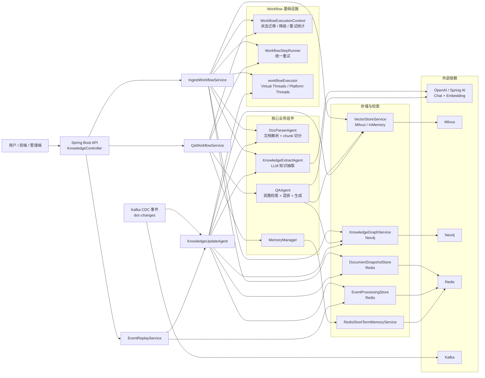
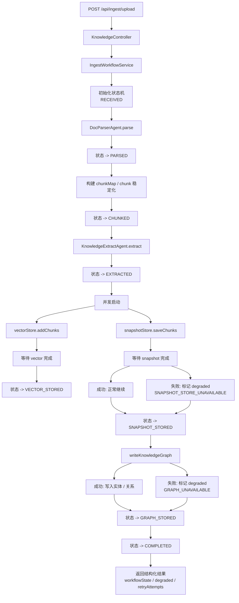
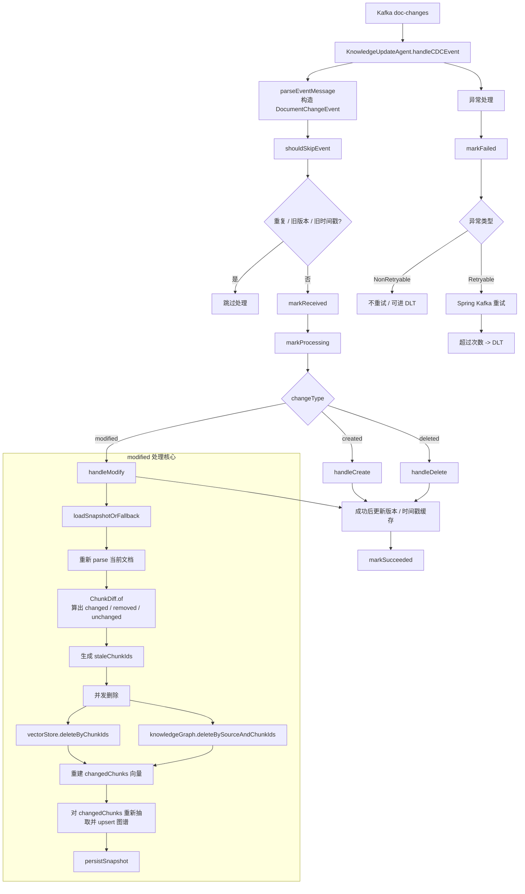
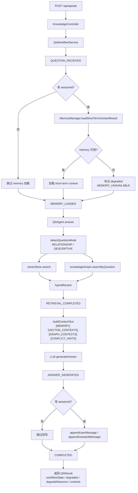
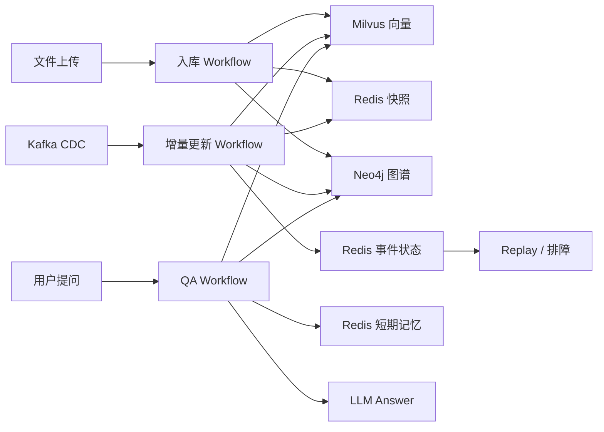

# 项目架构图与运行流程图

这份文档基于当前 Java 版实现整理，目标是把系统的核心结构和三条主运行链路讲清楚：

- 文档上传入库链路
- Kafka 增量更新链路
- QA 问答链路

文档中的图使用 Mermaid 绘制，适合直接预览，也适合后续继续整理到 README、PPT 或答辩材料里。

## 1. 系统架构图

### 架构说明

- `KnowledgeController` 是同步 API 入口，主要承接文件上传、问答请求、统计查看和事件回放。
- `IngestWorkflowService` 负责文档上传后的入库编排。
- `KnowledgeUpdateAgent` 负责 Kafka CDC 事件驱动的增量更新。
- `QaWorkflowService + QAAgent` 负责问答状态编排、记忆加载、双路检索和答案生成。
- `WorkflowExecutionContext` 和 `WorkflowStepRunner` 是两条 workflow 共用的轻量基础设施。
- `workflowExecutor` 统一承接当前已经接入的 Virtual Threads 业务子任务。

## 2. 文件上传入库流程图

### 入库流程说明

- 文档上传后先进入入库 workflow，而不是直接顺序调用到底。
- `vectorStore` 和 `snapshotStore` 在执行上是并发启动，但状态顺序按业务优先级先后推进。
- `vectorStore` 是硬依赖，写失败会整体失败。
- `snapshotStore` 和 `knowledgeGraph` 当前允许降级继续，用于保留主链路可用性。
- 接口最终会返回 `workflowState`、`degraded`、`degradeReasons` 和 `retryAttempts` 等结构化字段。

## 3. Kafka 增量更新流程图

### 增量更新流程说明

- Kafka 消息进入后，第一步不是直接更新，而是先做事件解析和跳过判断。
- `shouldSkipEvent` 同时承担幂等和顺序保护：
  - `eventId` 负责挡重复事件
  - `version` 负责主顺序保护
  - `timestamp` 在缺版本号时兜底
- `modified` 不是整篇删重建，而是基于 snapshot 做 chunk diff，只更新受影响的 chunk。
- 旧向量和旧图谱边会先按 `staleChunkIds` 清理，再写入新的 chunk 数据。
- 当前链路已具备失败状态、DLT 和 replay 能力，但还不是跨多存储事务级一致性闭环。

## 4. QA 问答流程图

### QA 流程说明

- QA workflow 和入库 workflow 共用基础设施，但有自己独立的状态语义。
- `memory` 加载和回写被明确放在不同阶段，避免把当前轮问题提前写入 prompt 上下文。
- `QAAgent` 里会同时走 vector 和 graph 两路检索，再按问题类型做轻量混排。
- 单路失败当前允许降级继续，只要另一条路还有结果。
- 最终返回的不只是答案，还包括 `workflowState`、`degraded`、`degradeReasons`、`contexts` 等结构化结果。

## 5. 一页总览图

如果只想快速看系统主路径，可以看下面这张总览图：

### 总结

当前项目可以概括成一套围绕文档知识入库、增量更新和双路检索问答构建的工程化知识服务：

- 上传链路负责把文档解析、抽取并落到向量、快照和图谱。
- Kafka 链路负责用事件驱动方式做幂等、顺序保护和局部更新。
- QA 链路负责加载短期记忆、做双路检索和结构化降级回答。
- 轻量状态机和统一重试设施负责把这些链路从“能跑”提升到“可解释、可监控、可扩展”。
